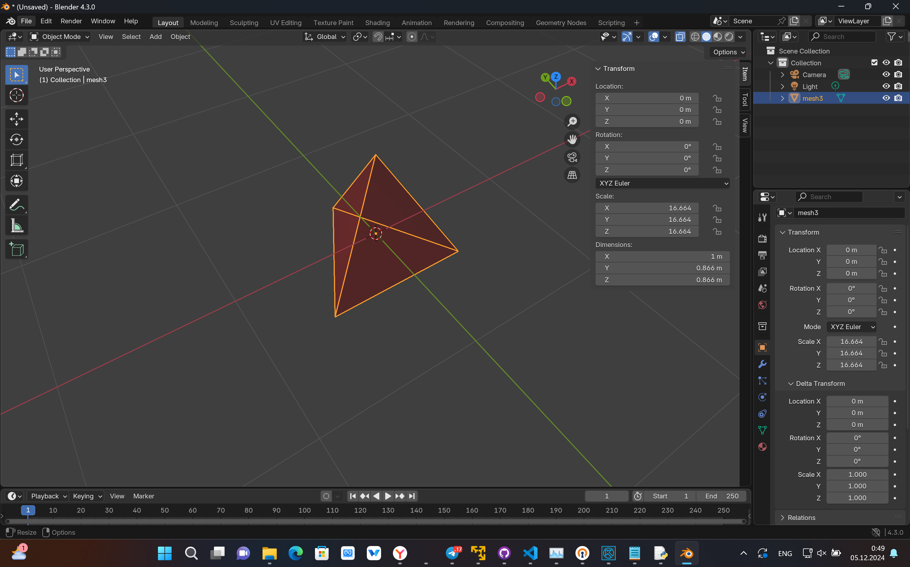
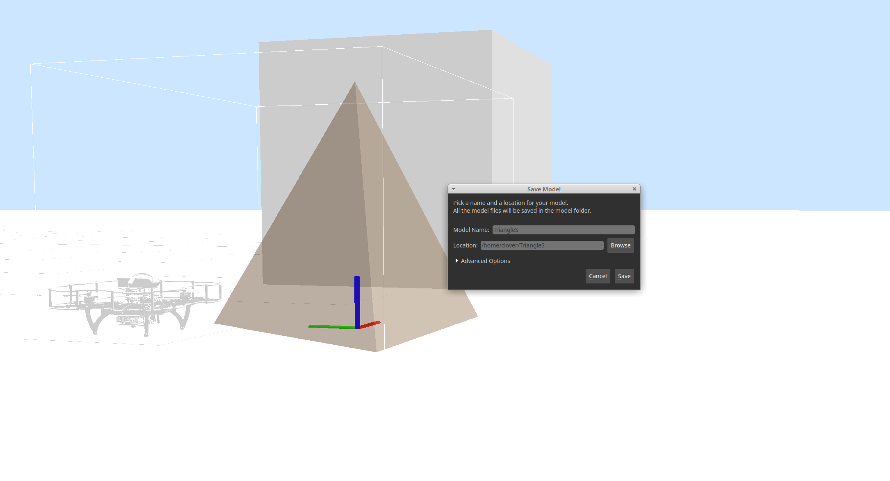
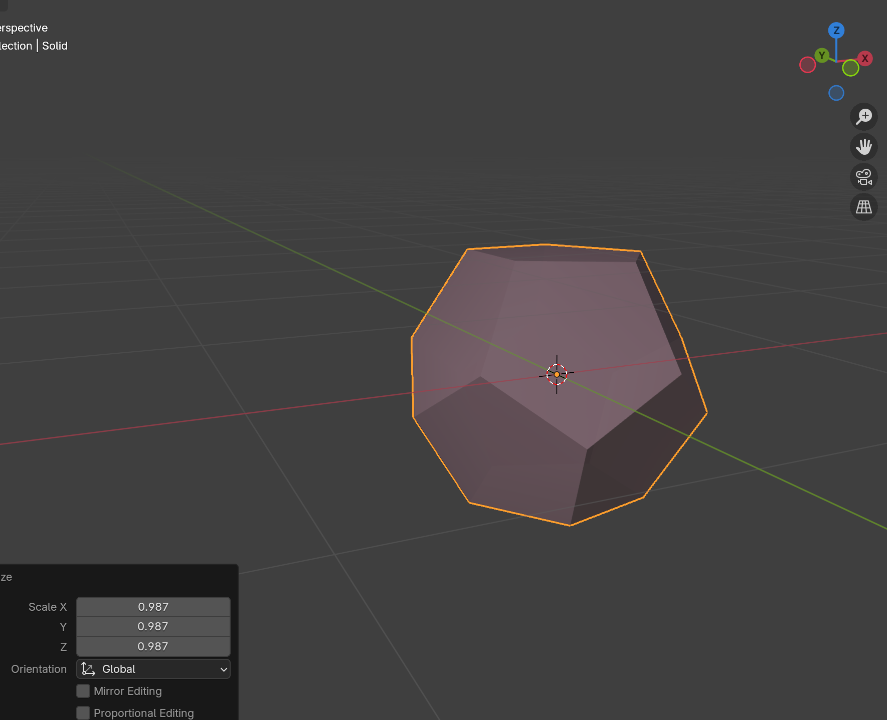
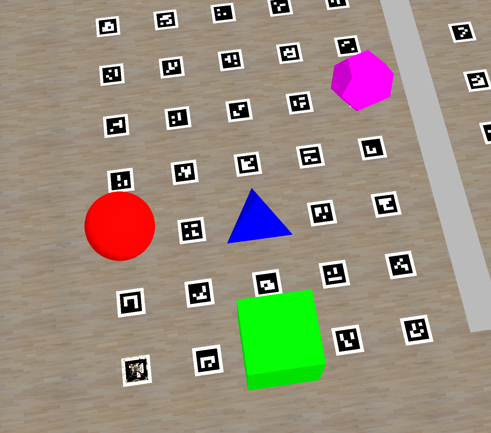

# Загрузка файлов мира

Что бы загрузить файлы мира исполняем команду в терминале:

```
git clone https://github.com/InvalitSyntax/vm_files_ItsWorkTeam.git && cd vm_files_ItsWorkTeam/files && chmod +x deploy_files.sh && ./deploy_files.sh && cd && rm -rf vm_files_ItsWorkTeam
```

# Инструкция по созданию мира

## Блок1

Создаем аруко карту

`rosrun aruco_pose genmap.py 0.3 10 10 1 1 0 --bottom-left -o map_nto.txt`

Удаляем ненужные маркеры из карты, настраиваем лаунчи 

```
rosrun clover_simulation aruco_gen --single-model --source-world=$(catkin_find clover_simulation resources/worlds/clover.world) $(catkin_find aruco_pose map/map_nto.txt) > $(catkin_find clover_simulation resources/worlds/clover_aruco.world)
```

Добавляем линию в `clover_aruco.world`:
```
<model name='center_line'>
        <pose>5 4.5 0.01 0 0 0</pose>
        <link name='link'>
          <collision name='collision'>
            <geometry>
              <box>
                <size>0.5 9.3 0.001</size>
              </box>
            </geometry>
          </collision>
          <visual name='visual'>
            <geometry>
              <box>
                <size>0.5 9.3 0.001</size>
              </box>
            </geometry>
            <material>
              <script>
                <name>Gazebo/Gray</name>
                <uri>file://media/materials/scripts/gazebo.material</uri>
              </script>
            </material>
          </visual>
        </link>
        <static>1</static>
      </model>
```

## Блок2

Встроенным редактором газебо создаем sdf куба и сферы, так же добавляем в `.world`
```
<model name="sphere">
    <!-- Sphere -->
    <pose>6 0 0.5 0 0 0</pose>
    <link name="sphere_link">
      <collision name="sphere_collision">
        <geometry>
          <sphere>
            <radius>0.5</radius> <!-- Diameter = 1m -->
          </sphere>
        </geometry>
      </collision>
      <visual name="sphere_visual">
        <geometry>
          <sphere>
            <radius>0.5</radius>
          </sphere>
        </geometry>
        <material>
          <script>
            <name>Gazebo/Red</name>
            <uri>file://media/materials/scripts/gazebo.material</uri>
          </script>
        </material>
      </visual>
    </link>
    <static>1</static>
  </model>

  <model name='box'>
    <pose>0 7.5 0.5 0 0 0</pose>
    <link name='link'>
      <collision name='collision'>
        <geometry>
          <box>
            <size>1 1 1</size>
          </box>
        </geometry>
      </collision>
      <visual name='visual'>
        <geometry>
          <box>
            <size>1 1 1</size>
          </box>
        </geometry>
        <material>
          <script>
            <name>Gazebo/Green</name>
            <uri>file://media/materials/scripts/gazebo.material</uri>
          </script>
        </material>
      </visual>
    </link>
    <static>1</static>
  </model>

```

Скачиваем модель правильного теругольника, в блендере ставим размеры, что бы он вписывался в куб 1х1, используя model editor газебо создаем фигуру из .dae модели, а так же задаем цвет, добавляем в мир






```
<model name='TriangleS'>
    <pose>0 2 0.02 0 0 0</pose>
    <link name='link_0'>
      <inertial>
        <mass>1</mass>
        <inertia>
          <ixx>0.166667</ixx>
          <ixy>0</ixy>
          <ixz>0</ixz>
          <iyy>0.166667</iyy>
          <iyz>0</iyz>
          <izz>0.166667</izz>
        </inertia>
        <pose>0 0 0 0 -0 0</pose>
      </inertial>
      <pose>-0 0 0 0 -0 0</pose>
      <gravity>1</gravity>
      <self_collide>0</self_collide>
      <kinematic>0</kinematic>
      <enable_wind>0</enable_wind>
      <visual name='visual'>
        <pose>0 0 0 0 -0 0</pose>
        <geometry>
          <mesh>
            <uri>/home/clover/triangle.dae</uri>
            <scale>1 1 1</scale>
          </mesh>
        </geometry>
        <material>
          <lighting>1</lighting>
          <script>
            <uri>file://media/materials/scripts/gazebo.material</uri>
            <name>Gazebo/Blue</name>
          </script>
          <shader type='pixel'>
            <normal_map>__default__</normal_map>
          </shader>
          <ambient>0 0 1 1</ambient>
          <diffuse>0 0 1 1</diffuse>
          <specular>0.00 0.00 0.01 1</specular>
          <emissive>0 0 0 1</emissive>
        </material>
        <transparency>0</transparency>
        <cast_shadows>1</cast_shadows>
      </visual>
      <collision name='collision'>
        <laser_retro>0</laser_retro>
        <max_contacts>10</max_contacts>
        <pose>0 0 0 0 -0 0</pose>
        <geometry>
          <mesh>
            <uri>/home/clover/triangle.dae</uri>
            <scale>1 1 1</scale>
          </mesh>
        </geometry>
        <surface>
          <friction>
            <ode>
              <mu>1</mu>
              <mu2>1</mu2>
              <fdir1>0 0 0</fdir1>
              <slip1>0</slip1>
              <slip2>0</slip2>
            </ode>
            <torsional>
              <coefficient>1</coefficient>
              <patch_radius>0</patch_radius>
              <surface_radius>0</surface_radius>
              <use_patch_radius>1</use_patch_radius>
              <ode>
                <slip>0</slip>
              </ode>
            </torsional>
          </friction>
          <bounce>
            <restitution_coefficient>0</restitution_coefficient>
            <threshold>1e+06</threshold>
          </bounce>
          <contact>
            <collide_without_contact>0</collide_without_contact>
            <collide_without_contact_bitmask>1</collide_without_contact_bitmask>
            <collide_bitmask>1</collide_bitmask>
            <ode>
              <soft_cfm>0</soft_cfm>
              <soft_erp>0.2</soft_erp>
              <kp>1e+13</kp>
              <kd>1</kd>
              <max_vel>0.01</max_vel>
              <min_depth>0</min_depth>
            </ode>
            <bullet>
              <split_impulse>1</split_impulse>
              <split_impulse_penetration_threshold>-0.01</split_impulse_penetration_threshold>
              <soft_cfm>0</soft_cfm>
              <soft_erp>0.2</soft_erp>
              <kp>1e+13</kp>
              <kd>1</kd>
            </bullet>
          </contact>
        </surface>
      </collision>
    </link>
    <static>1</static>
    <allow_auto_disable>1</allow_auto_disable>
  </model>

```

То же самое проделываем с додекаэдром




```
<model name='Dodecaedr'>
    <pose>9 7.5 0.5 0 0 0</pose>
    <link name='link_1'>
      <inertial>
        <mass>1</mass>
        <inertia>
          <ixx>0.166667</ixx>
          <ixy>0</ixy>
          <ixz>0</ixz>
          <iyy>0.166667</iyy>
          <iyz>0</iyz>
          <izz>0.166667</izz>
        </inertia>
        <pose>0 0 0 0 -0 0</pose>
      </inertial>
      <pose>0 -0 0 0 -0 0</pose>
      <gravity>1</gravity>
      <self_collide>0</self_collide>
      <kinematic>0</kinematic>
      <enable_wind>0</enable_wind>
      <visual name='visual'>
        <pose>0 0 0 0 -0 0</pose>
        <geometry>
          <mesh>
            <uri>/home/clover/dodecaedr.dae</uri>
            <scale>1 1 1</scale>
          </mesh>
        </geometry>
        <material>
          <lighting>1</lighting>
          <script>
            <uri>file://media/materials/scripts/gazebo.material</uri>
            <name>Gazebo/Blue</name>
          </script>
          <shader type='vertex'>
            <normal_map>__default__</normal_map>
          </shader>
          <ambient>1 0 1 1</ambient>
          <diffuse>1 0 1 1</diffuse>
          <specular>0.01 0 0.01 1</specular>
          <emissive>0 0 0 1</emissive>
        </material>
        <transparency>0</transparency>
        <cast_shadows>1</cast_shadows>
      </visual>
      <collision name='collision'>
        <laser_retro>0</laser_retro>
        <max_contacts>10</max_contacts>
        <pose>0 0 0 0 -0 0</pose>
        <geometry>
          <mesh>
            <uri>/home/clover/dodecaedr.dae</uri>
            <scale>1 1 1</scale>
          </mesh>
        </geometry>
        <surface>
          <friction>
            <ode>
              <mu>1</mu>
              <mu2>1</mu2>
              <fdir1>0 0 0</fdir1>
              <slip1>0</slip1>
              <slip2>0</slip2>
            </ode>
            <torsional>
              <coefficient>1</coefficient>
              <patch_radius>0</patch_radius>
              <surface_radius>0</surface_radius>
              <use_patch_radius>1</use_patch_radius>
              <ode>
                <slip>0</slip>
              </ode>
            </torsional>
          </friction>
          <bounce>
            <restitution_coefficient>0</restitution_coefficient>
            <threshold>1e+06</threshold>
          </bounce>
          <contact>
            <collide_without_contact>0</collide_without_contact>
            <collide_without_contact_bitmask>1</collide_without_contact_bitmask>
            <collide_bitmask>1</collide_bitmask>
            <ode>
              <soft_cfm>0</soft_cfm>
              <soft_erp>0.2</soft_erp>
              <kp>1e+13</kp>
              <kd>1</kd>
              <max_vel>0.01</max_vel>
              <min_depth>0</min_depth>
            </ode>
            <bullet>
              <split_impulse>1</split_impulse>
              <split_impulse_penetration_threshold>-0.01</split_impulse_penetration_threshold>
              <soft_cfm>0</soft_cfm>
              <soft_erp>0.2</soft_erp>
              <kp>1e+13</kp>
              <kd>1</kd>
            </bullet>
          </contact>
        </surface>
      </collision>
    </link>
    <static>1</static>
    <allow_auto_disable>1</allow_auto_disable>
  </model>
```

Полученные фигуры расставляем в нужные места полигона


Для задания движений создаем питон скрипт, в котором задаем траекторию движения, задаем случайную скорость, и сказываем какой объект мира перемещать - `указано в <model name=''>`:

Пример с движением по квадрату
```
#!/usr/bin/env python3
import rospy
import random
from gazebo_msgs.srv import SetModelState
from gazebo_msgs.msg import ModelState
from gazebo_msgs.srv import GetModelState
import time

def move_object(speed, move_distance, object_name):
    
    #print(time.time())
    # Constants
    LOOP_RATE_HZ = 20           # Frequency of the control loop in Hz
    POSITION_TOLERANCE = 0.01   # Minimum distance to consider as "reached"
    TIME_STEP_SEC = 1.0 / LOOP_RATE_HZ  # Time step for each loop iteration

    # Initialize the ROS node
    #rospy.init_node('move_object', anonymous=True)
    
    # Wait for the Gazebo services to become available
    rospy.wait_for_service('/gazebo/set_model_state')
    rospy.wait_for_service('/gazebo/get_model_state')

    set_model_state = rospy.ServiceProxy('/gazebo/set_model_state', SetModelState)
    get_model_state = rospy.ServiceProxy('/gazebo/get_model_state', GetModelState)

    # Directions for movement (X, Y)
    directions = [
        (move_distance, 0),   # Move along +X-axis
        (0, move_distance),   # Move along +Y-axis
        (-move_distance, 0),  # Move along -X-axis
        (0, -move_distance)   # Move along -Y-axis
    ]

    # Get the current position of the object
    model_state = get_model_state(object_name, "world")
    current_position_x = model_state.pose.position.x
    current_position_y = model_state.pose.position.y

    # Iterate over all directions
    for direction in directions:
        t = rospy.Time.now().to_sec()
        target_position_x = current_position_x + direction[0]
        target_position_y = current_position_y + direction[1]

        rate = rospy.Rate(LOOP_RATE_HZ)

        while (
            abs(current_position_x - target_position_x) > POSITION_TOLERANCE or
            abs(current_position_y - target_position_y) > POSITION_TOLERANCE
        ):
            # Calculate the step size for each axis
            step_x = speed * TIME_STEP_SEC if current_position_x < target_position_x else -speed * TIME_STEP_SEC
            step_y = speed * TIME_STEP_SEC if current_position_y < target_position_y else -speed * TIME_STEP_SEC
            d = (direction[0] ** 2 + direction[1] ** 2) ** 0.5
            step_x = direction[0] / (d/speed) * TIME_STEP_SEC
            step_y = direction[1] / (d/speed) * TIME_STEP_SEC

            # Update current positions
            if abs(current_position_x - target_position_x) > abs(step_x):
                current_position_x += step_x
            else:
                current_position_x = target_position_x

            if abs(current_position_y - target_position_y) > abs(step_y):
                current_position_y += step_y
            else:
                current_position_y = target_position_y

            # Create and send the state message
            state_msg = ModelState()
            state_msg.model_name = object_name
            state_msg.pose.position.x = current_position_x
            state_msg.pose.position.y = current_position_y
            state_msg.pose.position.z = model_state.pose.position.z  # Keep Z constant
            state_msg.pose.orientation = model_state.pose.orientation  # Keep orientation constant
            state_msg.twist.linear.x = step_x / TIME_STEP_SEC  # Linear speed approximation
            state_msg.twist.linear.y = step_y / TIME_STEP_SEC
            state_msg.reference_frame = "world"

            resp = set_model_state(state_msg)
            if not resp.success:
                rospy.logerr(f"Failed to move object: {resp.status_message}")
                return

            rate.sleep()

        #rospy.loginfo(f"Reached target position: ({target_position_x:.2f}, {target_position_y:.2f})")

        # Update the current position for the next direction
        current_position_x = target_position_x
        current_position_y = target_position_y
        #print(rospy.Time.now().to_sec() - t)


if __name__ == '__main__':
    rospy.init_node('move_object', anonymous=True)
    try:
        # Randomize speed and define parameters
        MIN_SPEED = 0.2
        MAX_SPEED = 0.6
        MOVE_DISTANCE = 2.83
        OBJECT_NAME = "box"  # Replace with your Gazebo model name


        speed = random.uniform(MIN_SPEED, MAX_SPEED)  # Randomized speed
        rospy.loginfo(f"Randomized speed for box: {speed:.2f} m/s")
        #speed = 0.5

        while not rospy.is_shutdown():
            move_object(speed, MOVE_DISTANCE, OBJECT_NAME)
    except rospy.ROSInterruptException:
        pass

```

После этого в simulator.launch создаем ноду, которая будет автоматически запускать скрипт при инифиализации мира (скрипт закидываем в уже существующий пакет, например `clover_simulation`):
```
    <node name="move_object" pkg="clover_simulation" type="box.py" output="screen" if="$(eval type == 'gazebo')">
        <param name="use_sim_time" value="true"/>
    </node>
```

Создаем ещё один дрон моделькой в aruco_world.world:
```
<model name='clover4'>
    <pose>10 0 0.084 0 0 0</pose>
    <link name='part1'>
      <pose>0 0 0 0 0 0</pose>
      <self_collide>0</self_collide>
      <inertial>
        <pose>0 0 0 0 -0 0</pose>
        <inertia>
          <ixx>1</ixx>
          <ixy>0</ixy>
          <ixz>0</ixz>
          <iyy>1</iyy>
          <iyz>0</iyz>
          <izz>1</izz>
        </inertia>
        <mass>1</mass>
      </inertial>
      <enable_wind>0</enable_wind>
      <kinematic>0</kinematic>
      <visual name='visual_part1'>
        <geometry>
          <mesh>
            <uri>model://clover5/clover_body_solid.dae</uri>
          </mesh>
        </geometry>
        <material>
          <shader type='pixel'/>
...
```

На этом мир готов. Все созданные файлы находятся в папке `files`
